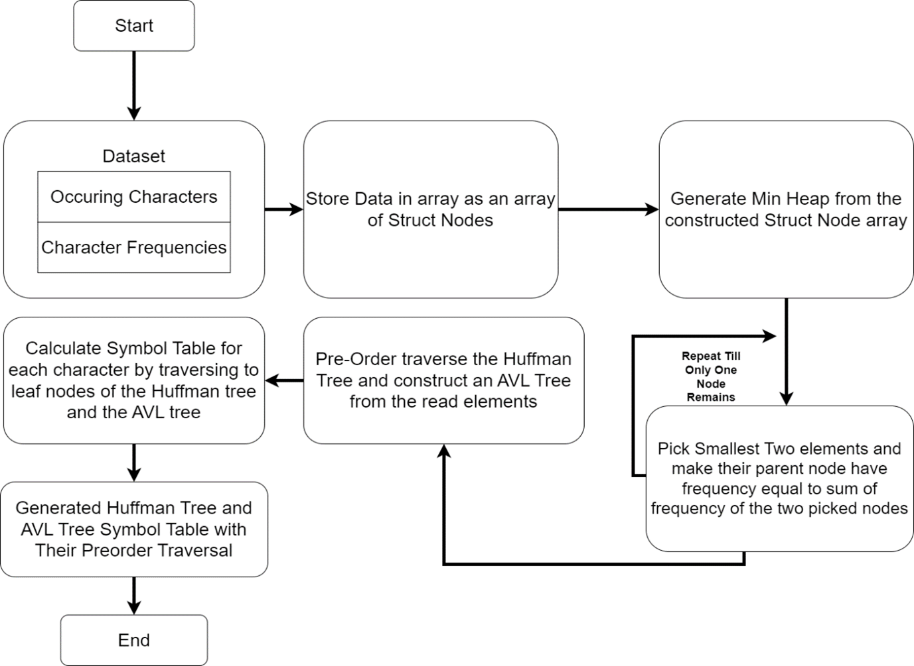

# Huffman Tree-Based Data Compression

## 📌 Overview

This project implements **Huffman Encoding** for data compression and explores its integration with **AVL Trees** for symbol table operations. The primary goal is to efficiently encode a dataset of characters based on frequency and analyze the impact of AVL tree construction on Huffman trees.

## 🚀 Features

-   **Huffman Encoding** for data compression.
-   **MinHeap-based Huffman Tree Construction**.
-   **Symbol Table Generation** for optimized storage.
-   **AVL Tree Integration** for frequency-based node balancing.
-   **Preorder and Inorder Traversal Outputs**.

## 📜 Methodology



1. **Dataset Representation**

    - The dataset consists of characters and their frequency counts.
    - Stored in two parallel arrays (character array & frequency array).

2. **Huffman Tree Construction**

    - Construct a **MinHeap** from dataset frequencies.
    - Extract two smallest nodes iteratively and form **Huffman Nodes**.
    - Repeat until a single root node remains.

3. **Symbol Table Generation**

    - Traverse the Huffman tree to assign binary codes to each character.
    - Store these codes in a **Symbol Table**.

4. **AVL Tree Construction from Huffman Tree**
    - Perform **preorder traversal** of Huffman Tree.
    - Insert nodes into an **AVL Tree**.
    - Observe issues with AVL-based symbol storage.

---

## 📷 System Overview

### **Huffman Tree Construction**


### **AVL Tree Representation**


---

## 📊 Results & Observations

### **Huffman Encoding Symbol Table Output**

-   The most frequently occurring character gets the **shortest binary encoding**.
-   **Example Output:**
    ```sh
    Character: f, Frequency: 45, Code: 0
    Character: c, Frequency: 12, Code: 101
    ```

### **AVL Tree-Based Encoding Issues**

-   AVL Tree balancing disrupts Huffman encoding paths.
-   Some characters lose their optimal encoding positions.

---

## 🛠 Installation & Setup

### 🔹 Prerequisites

-   **C Compiler (GCC recommended)**
-   **Dev-C++ 5.11 (or any C-supported IDE)**

### 🔹 Steps to Run

```sh
# Clone the repository
 git clone https://github.com/devilb2103/Huffman-Encoding-DSA
 cd Huffman-Encoding-DSA

# Compile and run the program
 gcc main.c -o huffman -lm
 ./huffman
```

---

## 📄 License

This project is licensed under the **MIT License**.
